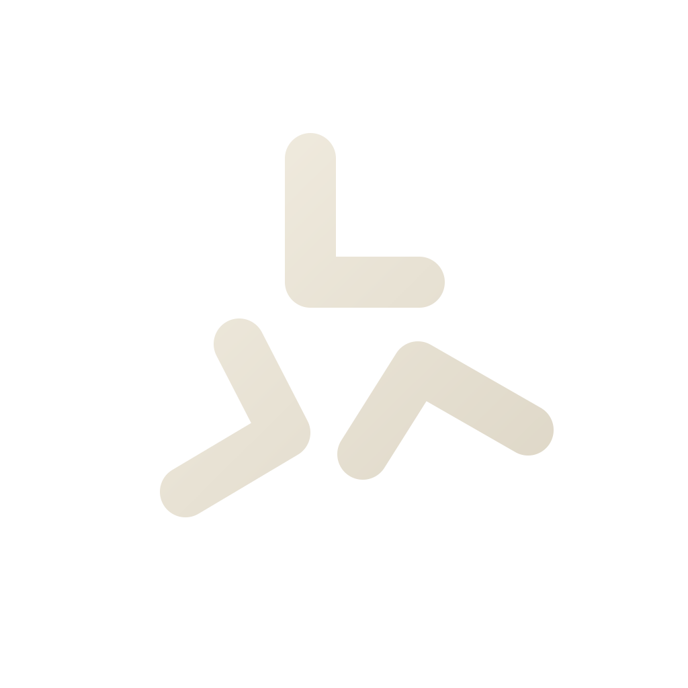
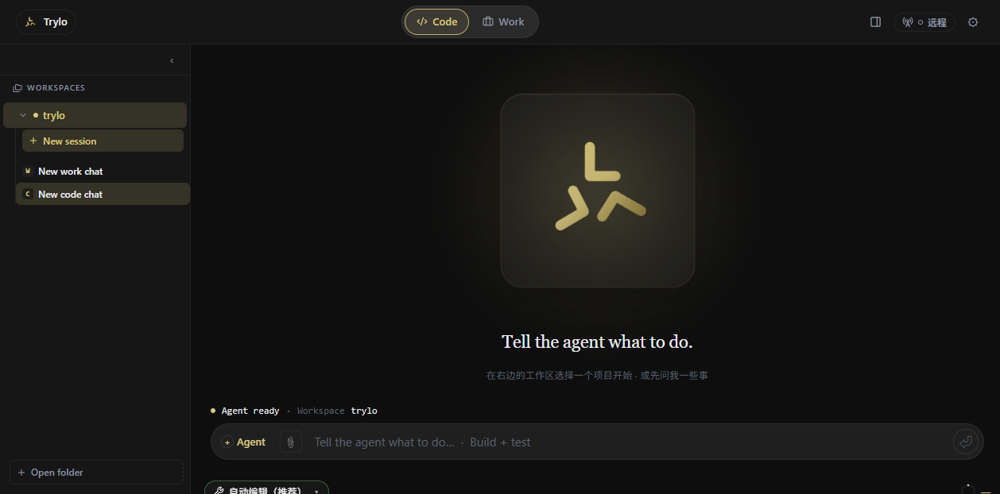

<div align="center">



# Trylo

**An agent-native development environment with a long-running personal agent at its core.**

[](LICENSE)
[]()
[]()
[]()

[Website](https://trylocode.me) · [Web Chat](https://chat.trylocode.me) · [Android App](https://trylocode.me)

</div>

---

Trylo is a workspace where a personal agent doesn't just answer questions — it
**lives across sessions**: it plans on a board, works through task seats,
keeps a memory that survives restarts, and drives real tools (Office
documents, spreadsheets, presentations, browsers) on your machine.

A year ago it was a panel in a sidebar. Now it has its own window, a desktop
pet that follows your cursor, a phone in your pocket that can remote-command
your machine — and a learning system that actually studies how *you* work.

<p align="center">
  
</p>

> **Status: work in progress.** The desktop client is in daily use as an
> alpha, and the Android app is released. The packaged `trylo` CLI is under
> active development and is **not** part of this repository yet. Expect rough
> edges, fast movement, and an honest commit history.

## Two rhythms, one conversation

**Code** owns the code. **Work** owns the deliverable. Thinking, executing and
shipping happen in the same chat window — you just switch gears.

| | **Code** — pair-programming mode | **Work** — delivery mode |
|---|---|---|
| **Chat** | Ask about any line of code like you'd ask a colleague. Answers land in real project context — no guessing, no making things up. | Knows what "done" means: a deck, a page, a set of docs — and pushes the task to an actual artifact. |
| **Plan** | Reads the project, searches related code, unfolds its reasoning, then offers one-click implementation. | Advances through briefed stages — outline → visuals → per-page generation → QA — and pauses for your approval at the gates. |
| **Agent** | Reads files, edits code, builds tests, runs verification — live progress, stoppable at any time. | Results land in a result dock; unhappy with a page? Revise just that page. |
| **Cognition** | A single entry point where a few conversations become evidence the learning system starts from. | — |

## One partner, everywhere

Four release surfaces, one memory and approval system.

| Surface | Platform | What it does |
|---|---|---|
| **Trylo Desktop** | Windows · Tauri 2 *(alpha)* | The host: Code / Work dual mode, tool platform, desktop pet, remote gateway. |
| **Trylo Code mobile** | Android · [released](https://trylocode.me) | Chat direct to 24 model providers; scan a QR to remote-command the desktop and approve sensitive operations. |
| **Trylo Miu (pet)** | Windows · WPF | Acts out the agent's live state: analyzing, coding, reviewing, done. |
| **Web chat** | [chat.trylocode.me](https://chat.trylocode.me) | No install needed; an early demo — desktop remains the source of truth. |

## Under the hood

Quiet, boring-on-purpose fundamentals — the kind you notice every day:

- **Local-first** — OpenAI / Anthropic-compatible custom endpoints; the model
  is your choice, and mobile sessions stay on the device.
- **Keys never leave the machine** — desktop keys are stored locally; on
  Android they sit in the Keystore with cloud backup disabled.
- **Approval culture** — writes require approval, prompt-injection scanning,
  skill safety review, and a fail-close default: suspicious means blocked.
- **Cross-device** — QR pairing between phone and desktop over a
  Cloudflare Tunnel + one-time ticket; watch tasks, send messages, grant
  permissions remotely.
- **Real tools** — Office documents, Playwright browser automation, Windows
  control, DevTools debugging. Toggle per tool, health at a glance.
- **Tested** — 1,386 + 353 + 301 automated tests kept green, strict Rust
  Clippy, and persistent sessions that survive closing the window.

## How the pieces fit

```
┌─────────────────────────────┐     ┌──────────────────────────────┐
│  desktop (Tauri)            │     │  desktop-services (Node)     │
│  chat · team seats · work   │◄───►│  host loop · learning · pet  │
│  settings · tool cards      │IPC  │  chat · remote gateway       │
└──────────────┬──────────────┘     └──────────────────────────────┘
               │ drives
        ┌──────▼──────────┐
        │  agent runtime   │  installed separately (Claude Code),
        │  + your tools    │  plus MCP tools (OfficeCLI, AutoCAD…)
        └─────────────────┘
```

The desktop client is an agent **host**, not an agent: it drives a locally
installed agent runtime and MCP tools. One of those tools is
[OfficeCLI](https://github.com/iOfficeAI/OfficeCLI) — an AI-friendly CLI for
Office documents that Trylo contributes to upstream.

## Repository map

```
trylo/
├── desktop/            Tauri desktop client (React/TS UI + Rust shell)
├── desktop-services/   Node sidecar: service-host loop, learning loop,
│                       pet-chat, remote gateway adapters, tool health
├── work/               The Work module: task board, recordings, agent conduct
├── mobile-app/         Capacitor mobile shell (Android)
├── trylocode-site/     Product website (Cloudflare Pages)
├── docs/               Test fixtures used by the desktop host-adapter suite
└── scripts/            Workspace helper scripts
```

## Getting started (development)

Prerequisites: Node 20+, pnpm 9+, Rust toolchain (for Tauri).

```bash
# desktop client (dev loop)
cd desktop
pnpm install
pnpm tauri:dev

# service sidecar
cd desktop-services
npm install
npm start        # node src/host.mjs

# website (Cloudflare Pages)
cd trylocode-site
npm install
node deploy.mjs  # deploy; see DEPLOY.md
```

> The agent runtime is **not** bundled in this repository. Install
> [Claude Code](https://code.claude.com/docs) locally; the desktop client
> adapts to it. Vendored tooling (ripgrep) is attributed in [NOTICE](NOTICE).

## Documentation

This is the first public drop: code, tests, and the site. The architecture
notes, audit reports, and product specifications that drove development so far
were written as internal working documents — they will be curated for
publication over time. Until then, the architecture sketch above is the source
of truth, and the code comments in `desktop/src/host-adapter/` and
`desktop-services/src/` carry the per-module detail.

## Contributing

Early days: the architecture is still moving. Issue reports and focused PRs
are welcome — see the repository map above for where things live. Larger
surfaces (team seats, learning loop) are in flux; open an issue to discuss
before building against internals.

## License

[Apache-2.0](LICENSE). Third-party components are attributed in
[NOTICE](NOTICE). The separately installed agent runtime keeps its own license
and terms.

---

<div align="center">

*Ideas deserve to be built — from an idea, to a try, to a product.*
**Build fast. Learn faster. Keep shipping.**

</div>
