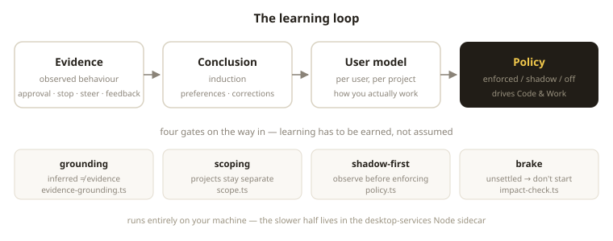
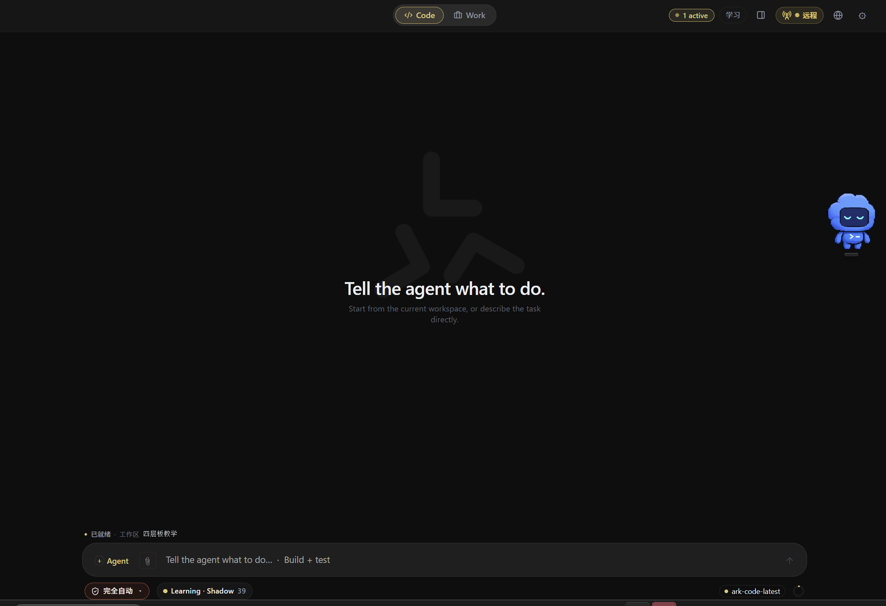
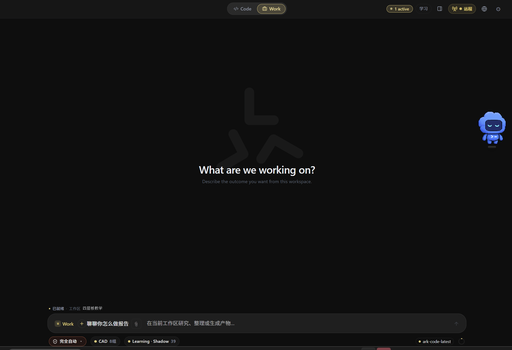
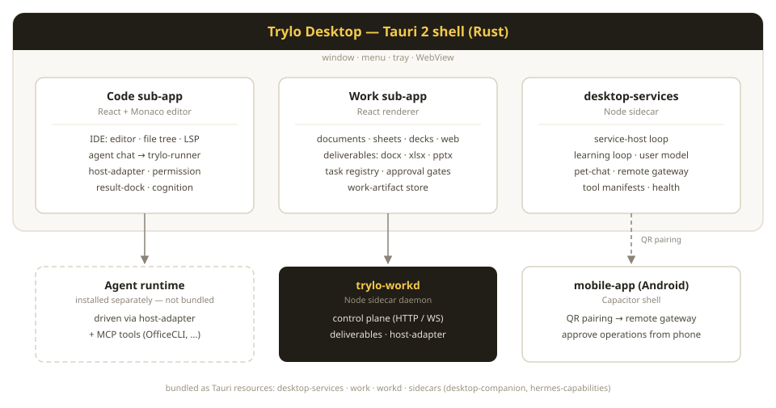

<div align="center">


# Trylo

**Trylo Desktop —— 一个会学习你怎么干活的 Agent 宿主。今天它有两个子应用：Code 管代码，Work 交成品。**

[English](README.md) | [简体中文](README.zh-CN.md)

[](LICENSE)
[]()
[]()

</div>

> **状态：进行中。** 桌面端处于 alpha，日常自用。`trylo` CLI 仍在开发中，**不在本仓库**。接口与目录结构都可能变动。

## 理念：会反过来学习你的 Agent

大多数 Agent 每次会话都从零开始——同样的问题、同样的纠正、同样的坑。Trylo 的赌注正好相反：**Agent 应该一点点积累出"你怎么工作"的模型**，而这个模型必须是**挣来的，不是猜来的**。

整套设计的出发点只有一句：**误解你，比不了解你更糟**。所以学习不是"把聊天记录塞进向量库"，而是一条**带闸门的流水线**：

<p align="center">
  
</p>

**证据 → 结论 → 用户模型 → 策略。** 证据只来自你真实做过的事：审批、叫停、中途纠正、对产物的反馈（`evidence.ts`、`evidence-grounding.ts`）；结论从证据里归纳；模型按**用户 + 项目**两个维度沉淀；最后由策略去驱动 Code 与 Work。

路上设了四道闸：

- **证据必须真实（grounding）** —— 推断出来的不是证据，只有被观察到的行为才算（`evidence-grounding.ts`）。
- **范围隔离（scoping）** —— 学习按项目隔离（`scope.ts`），这个项目养成的习惯永远不会变成那个项目的规矩。
- **先跑影子模式（shadow-first）** —— 每条策略维度有 `enforced` / `shadow` / `off` 三态（`policy.ts`）。新规则先在暗处观察，确认无扰才真正生效。
- **拿不准就刹车（brake）** —— 存在高影响且尚未确定的偏好时，任务不会启动：`impact-check.ts` 判定影响，`decision-governor.ts` 返回 `pending_impact` 而不是 `ready`。宁可停下，也不误解你。

这一切都跑在你自己的机器上。慢的那一半在 `desktop-services` 这个 Node 侧车里：`learning-loop-service`、`history-mining-service`、`shadow-runner`、`curation-service`、`pending-admin-service`。代码在 `desktop/src/user-learning/`、`desktop/src/learning/` 和 `desktop-services/src/learning/`。

## 今天它是什么：两个子应用

| 子应用 | 位置 | 做什么 |
|---|---|---|
| **Code** | `desktop/` | IDE — Monaco 编辑器 + 文件树 + LSP + Agent 对话，走 `trylo-runner` |
| **Work** | `work/` | 文档 / 表格 / 演示 / 网页产物 — 生成 `.docx` / `.xlsx` / `.pptx` |

两者在运行时层面互相独立，不共享代码与进程状态；共享 Tauri 外壳（窗口、菜单、托盘）、设计系统（`desktop/src/styles/tokens.css`）和工作区路径。

<p align="center">
  
  
</p>

跨设备控制：Android 端扫码与桌面配对，远程查看任务、发消息、审批敏感操作。

<p align="center">
  
</p>

## 架构

<p align="center">
  
</p>

桌面端是 Agent 的**宿主**而非 Agent 本身：它驱动一个本地安装的 agent runtime 与 MCP 工具链。相关工具之一是 [OfficeCLI](https://github.com/iOfficeAI/OfficeCLI)——Trylo 也向上游贡献代码。

打包时以 Tauri resource 形式随行：`desktop-services`、`work`、`workd`、`sidecars/desktop-companion`（桌宠）、`sidecars/hermes-capabilities`。

## 仓库地图

| 目录 | 包 | 说明 |
|---|---|---|
| `desktop/` | `trylo-desktop` | Tauri 客户端：React/TS 前端 + Rust 外壳 |
| `desktop-services/` | `@trylo/desktop-services` | Node 侧车：服务宿主循环、学习循环、桌宠、远程网关 |
| `work/` | `@trylo/work` | Work 子应用：`trylo-workd` 守护进程、控制面、产物生成 |
| `mobile-app/` | `trylocode` | Capacitor 移动端外壳（Android） |
| `trylocode-site/` | — | 产品官网（Cloudflare Pages） |
| `docs/` | — | 桌面端 host-adapter 测试用的夹具 |
| `scripts/` | — | 工作区辅助脚本 |

## 本地跑起来

环境要求：**Node 22+**（`desktop` / `desktop-services`；`work` 为 20+）、pnpm、Rust 工具链（Tauri 构建用）。

```bash
# 桌面客户端
cd desktop && pnpm install && pnpm tauri:dev

# desktop-services 侧车
cd desktop-services && npm install && npm start   # node src/host.mjs

# Work 守护进程
cd work && node ./bin/trylo-workd.mjs

# 官网（Cloudflare Pages，部署见 DEPLOY.md）
cd trylocode-site && npm install && node deploy.mjs
```

## 测试

三个包各自一套：

```bash
cd desktop           && pnpm test   # vitest
cd desktop-services  && npm test    # node --test + pet-chain smoke
cd work              && npm test    # node --test（TS 走 register hook）
```

桌面端另有 `pnpm typecheck`、`pnpm lint`、`pnpm format:check`。

## 不在本仓库内

- **`trylo` CLI** — 开发中，尚未开源。
- **Agent runtime** — 需自行本地安装，桌面端通过 `host-adapter` 适配。
- **内部文档** — 架构说明、审计报告、产品规格当初都是内部工作稿，会逐步整理公开。在此之前，上面的架构图和 `desktop/src/host-adapter/`、`desktop-services/src/` 里的注释是最可靠的细节来源。
- 第三方组件（含 vendored ripgrep）见 [NOTICE](NOTICE)。

## 参与

早期阶段，架构仍在移动。欢迎 issue 与聚焦的 PR——先看仓库地图确认改动落在哪一层。learning loop、team seats 这类面还在变化，动内部实现前请先在 issue 里对齐。

## 许可

[Apache-2.0](LICENSE)。第三方组件见 [NOTICE](NOTICE)。单独安装的 agent runtime 遵循其自身的许可与条款。
